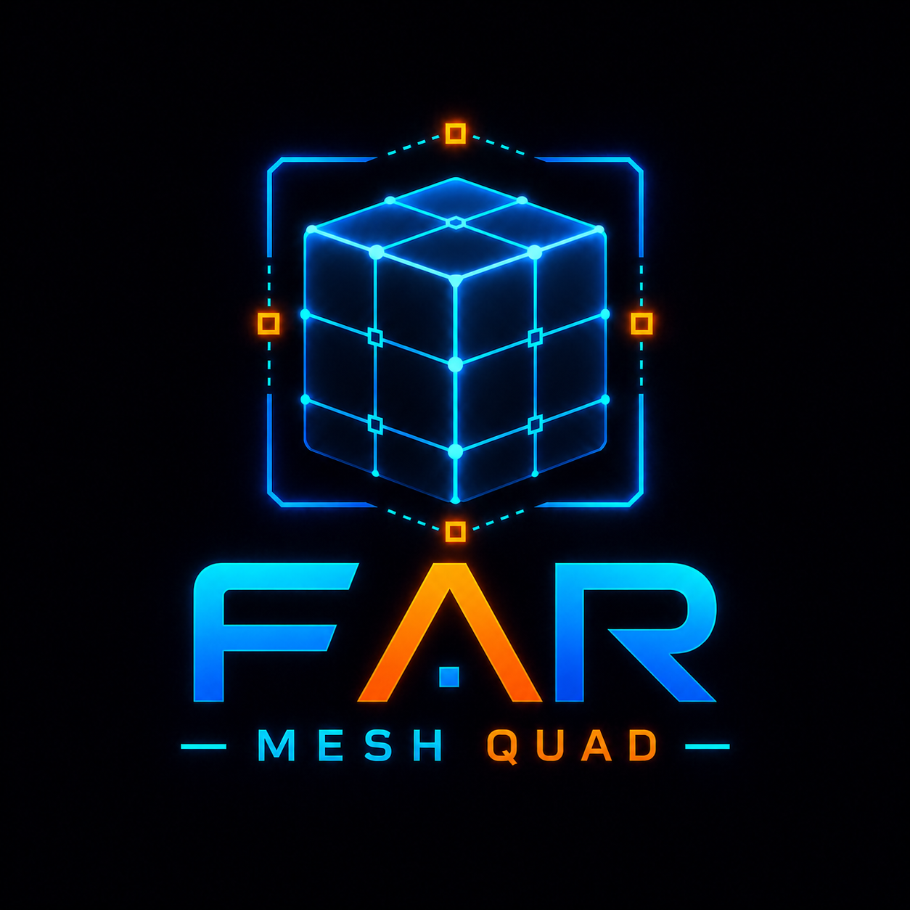
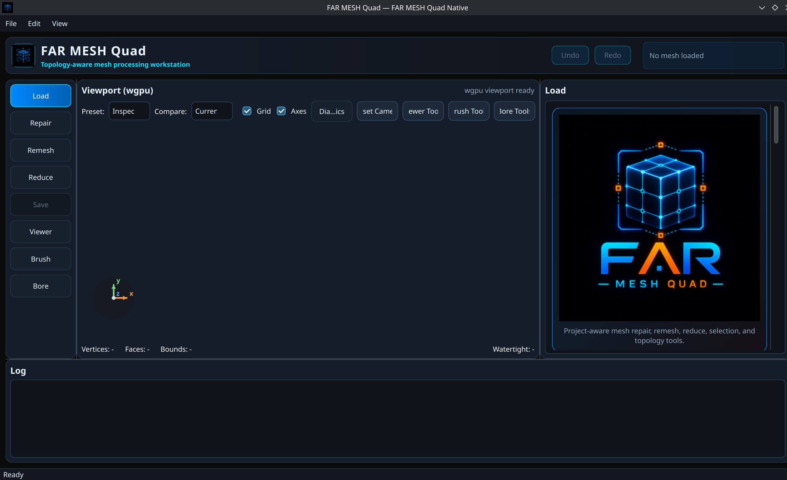
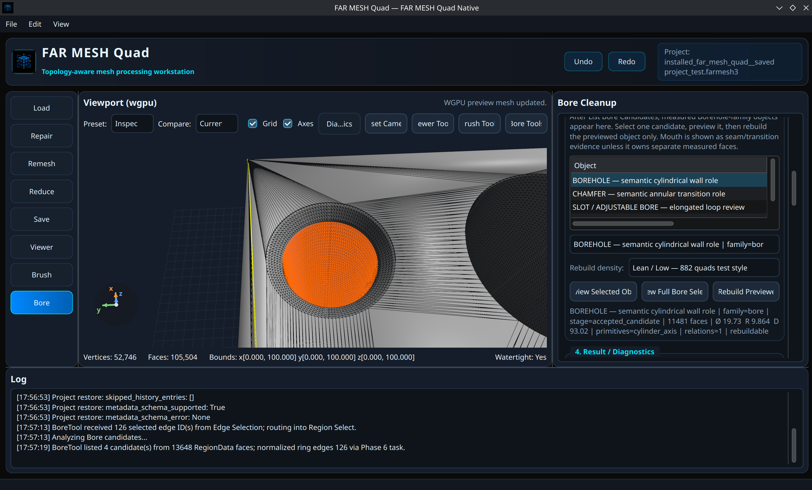
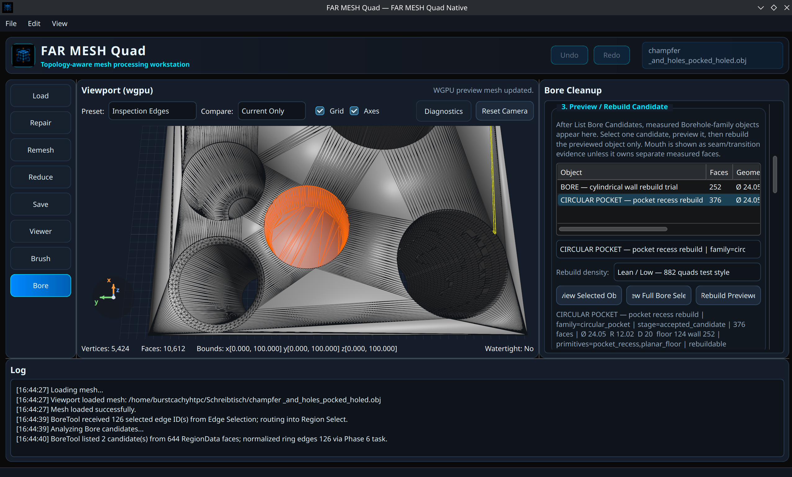
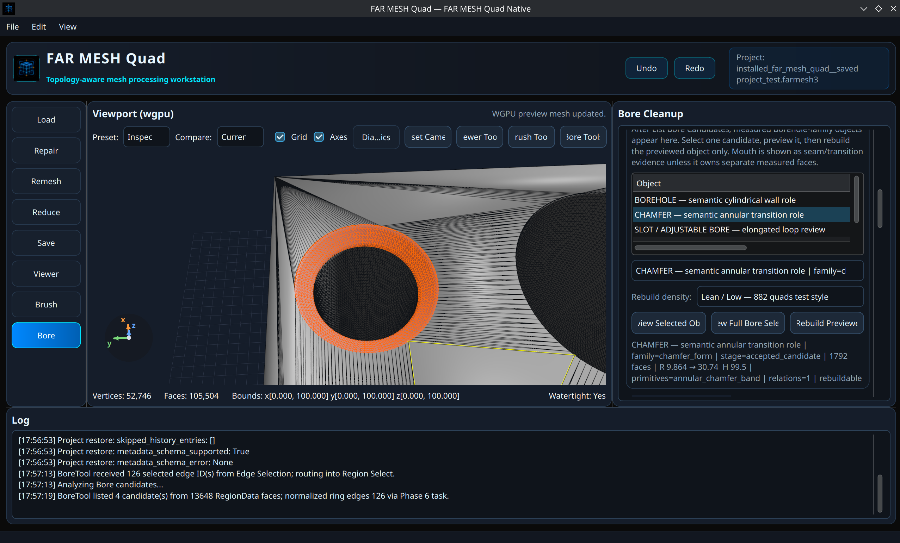
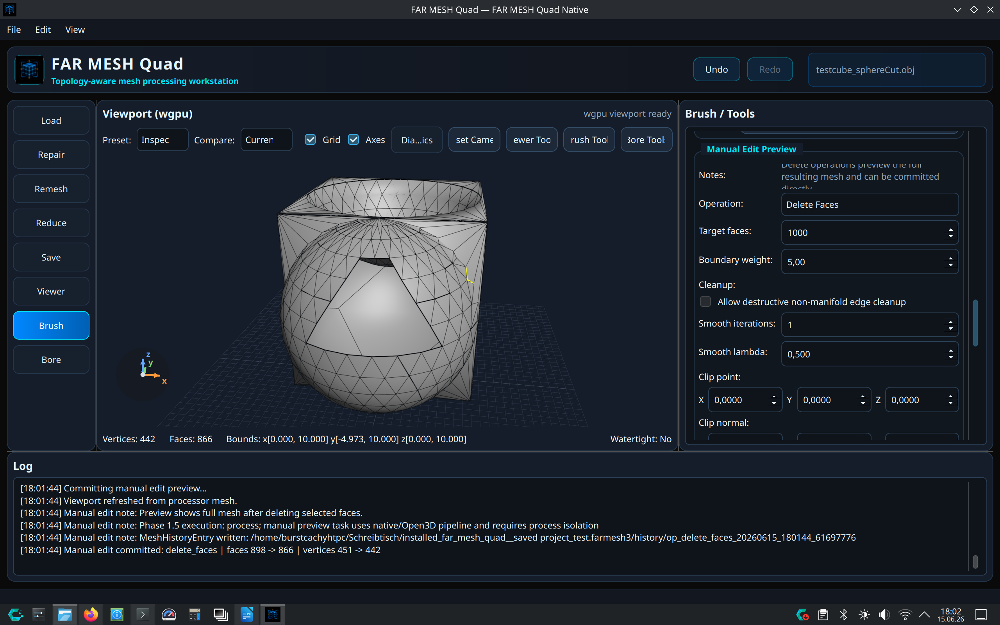
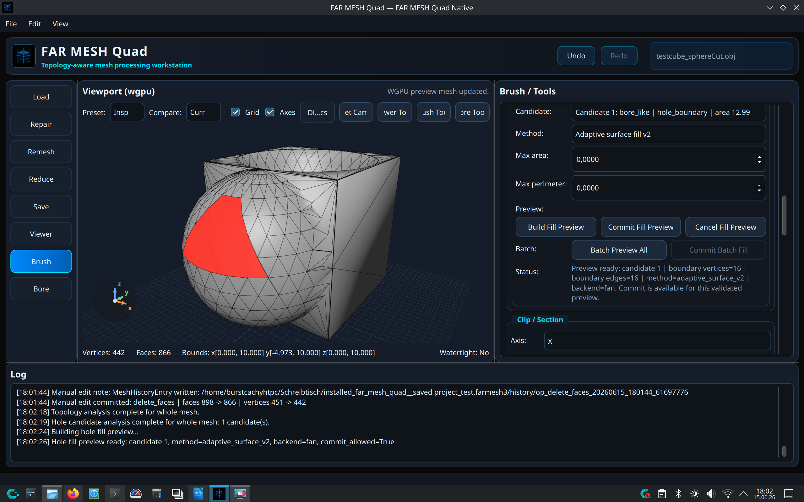
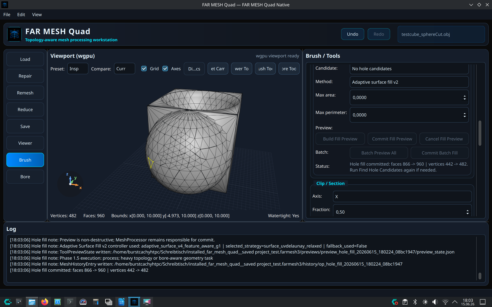
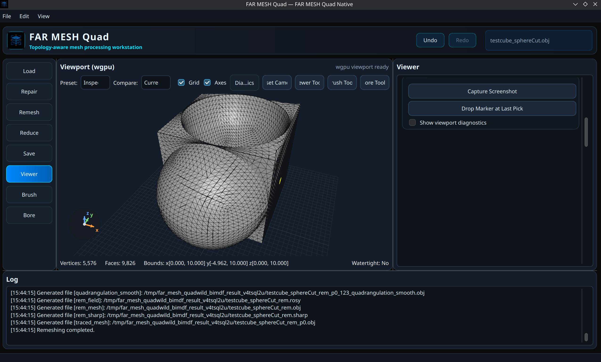

<p align="center">
  
</p>

# FAR MESH Quad

**FAR MESH Quad** is a Linux-first interactive mesh-processing workstation for CAD-adjacent mesh repair, remeshing, inspection, and topology-aware rebuild workflows.

It combines a desktop GUI, a live WGPU viewport, project persistence, mesh repair tools, external remeshing backends, undo/redo history, hole filling, and the developing FAR MESH BoreTool pipeline for selected bore recognition and rebuild.

FAR MESH Quad is not just a mesh viewer and not just a wrapper around one external executable. It is a layered operator environment where the processing core owns the active mesh, the GUI coordinates user intent, the viewport displays and selects, and background task systems keep heavy operations out of the live interface.

---

## Current status

FAR MESH Quad is in active development.

Current validated checkpoint:

* Linux target: CachyOS / Arch Linux family
* Primary live viewport: WGPU
* Fallback viewport: PyVista / VTK
* Current preferred package: native no-venv Arch/CachyOS package
* Package name: `far-mesh-quad-native`
* Install root: `/opt/far-mesh-quad-native`
* Launcher: `/usr/bin/far-mesh-quad-native`
* Python model: system Python 3.14 with native C wrapper
* Current development environment: `venv_sysqt314`
* Current development launcher: `scripts/run.sh`

The native source installer has been validated with system dependency binding, vendored Open3D/WGPU package installation, WGPU startup, dependency imports, native wrapper launch, project restore, Bore candidate analysis, Bore rebuild, undo, redo, desktop integration, and license payload installation.

The public GitHub repository is intended to install from a clean clone through the Option B native source-installer path with bundled Instant Meshes, QuadWild-BiMDF, vendored Open3D, vendored WGPU stack packages, and the full license bundle.

---

## Quick links

* [Install from source on Arch / CachyOS](HOW_TO_INSTALL.md)
* [Advanced manual native package build](HOWTO_BUILD.md)
* [Root license](LICENSE)
* [FAR MESH Quad license scope notice](bin/License/LICENSE_FAR_Mesh_Quad.txt)
* [Bundled license files](bin/License)

---

## Screenshots

### Main viewport



### BoreTool recognition and rebuild workflow



### Pocket recognition workflow



### Chamfer / transition feature view



### Hole fill workflow







### Remeshing workflow



---

## Features

### Interactive mesh workstation

* Load and inspect triangle meshes.
* Display meshes in an integrated Qt desktop application.
* Use WGPU as the primary live viewport.
* Use PyVista / VTK as a fallback viewport path.
* Save and reopen `.farmesh3` project files.
* Preserve project metadata and current mesh state.
* Use undo/redo history for committed mesh operations.

### Mesh processing

* Mesh repair and cleanup helpers.
* Hole-fill and guarded repair workflows.
* Mesh reduction and simplification paths.
* Open3D-backed processing where appropriate.
* Trimesh / PyVista / VTK interoperability.
* Structured operation reporting and generated-file tracking.

### Remeshing backends

FAR MESH Quad bundles and orchestrates external remeshing tools as runtime assets:

* **Instant Meshes** for fast field-aligned remeshing.
* **QuadWild-BiMDF** for quality-first quad remeshing pipelines.

These tools are not treated as optional source extras. Their binaries, configuration files, and required libraries are part of the FAR MESH runtime boundary.

### BoreTool

The FAR MESH BoreTool is the current bore-aware repair and rebuild pipeline.

Current validated workflow:

1. Select bore rim/opening edges.
2. Route selected edge IDs into Region Select.
3. Build RegionData and local geometric evidence.
4. Run recognition and candidate analysis through the Phase 6 task path.
5. Preview recognized Bore candidates.
6. Compute rebuild target through a background task.
7. Commit the rebuilt result through the parent MeshProcessor path.
8. Refresh the viewport and preserve undo/redo history.

The BoreTool architecture keeps responsibilities separated:

* Region Select collects evidence.
* Recognition owns feature identity.
* Rebuild Target owns delete-patch eligibility.
* Rebuild computes replacement geometry.
* MeshProcessor owns the committed active mesh.
* Viewport displays only.

---

## Installation

### Recommended public source install

The recommended public install path for Arch / CachyOS is the native Option B source installer.
It installs FAR MESH Quad as a native system application without an application virtual environment.

See the full guide:

```text
HOW_TO_INSTALL.md
```

Fresh clone:

```bash
git clone https://github.com/Clarke-Projects/FAR-Mesh-Quad.git
cd FAR-Mesh-Quad
```

Preview first:

```bash
bash packaging/install/install_far_mesh_quad.sh --target cachyos --dry-run
```

Install on an already-updated Arch / CachyOS system:

```bash
bash packaging/install/install_far_mesh_quad.sh --target cachyos --yes
```

Install on a fresh machine when you intentionally want a full system update first:

```bash
bash packaging/install/install_far_mesh_quad.sh --target cachyos --yes --system-update
```

Launch:

```bash
far-mesh-quad-native
```

Installed layout:

```text
/opt/far-mesh-quad-native/
  far_mesh/
  bin/
    Instant Meshes
    quadwild
    config/
    License/
  quadwild-bimdf/
  scripts/

/usr/bin/far-mesh-quad-native
/usr/share/applications/far-mesh-quad-native.desktop
/usr/share/icons/hicolor/256x256/apps/far-mesh-quad-native.png
/usr/share/licenses/far-mesh-quad-native/
```

The native launcher is a compiled C wrapper. It embeds system CPython for the main GUI process and forces multiprocessing helpers back to `/usr/bin/python`, preventing recursive worker launches.

Expected startup messages may include:

```text
[viewport_factory] Using WGPU viewport backend.
preconfigure_default_device (pygfx): required_features set to {'!float32-filterable'} removes earlier set {'float32-filterable'} from the set.
Unable to find extension: VK_EXT_physical_device_drm
```

The Vulkan extension warning is currently non-blocking on the validated development machine.

### Advanced manual native package build

`HOWTO_BUILD.md` is kept as the advanced/manual package-build reference.
It is useful for maintainers who want to run the lower-level `build-local-package.sh` and `pacman -U` package workflow directly. It is not the primary public install path anymore.

### Option A: private-venv fallback package

Option A is the larger conservative package that carries a private Python environment under `/opt/far-mesh-quad`.

It remains useful as a fallback while development is active, but the current validated public install path targets Option B native.

If an Option A package is provided as a release asset or produced locally, install it with:

```bash
sudo pacman -U far-mesh-quad-0.1.2-1-x86_64.pkg.tar.zst
```

Run:

```bash
far-mesh-quad
```

---

## Development launch

From the project root of the local development tree:

```bash
cd ~/Schreibtisch/FAR_MESH_quad_3
bash scripts/run.sh
```

Current development environment:

```text
venv_sysqt314
```

Equivalent direct command:

```bash
cd ~/Schreibtisch/FAR_MESH_quad_3
env FAR_MESH_VIEWPORT_BACKEND=wgpu QT_QPA_PLATFORM=xcb venv_sysqt314/bin/python -m far_mesh.main
```

Do not use the old deleted `venv` path.

Note: the clean public repository is validated for native package build and install. The local development launcher expects the maintainer development environment to already exist.

---

## Runtime validation

After installation or development-environment changes, validate the following:

```bash
cd /opt/far-mesh-quad-native

/usr/bin/python -c '
import far_mesh
import trimesh, open3d, pyvista, pyvistaqt, vtk
import rendercanvas, wgpu, pylinalg, pygfx
print("FAR MESH native package dependency smoke test OK")
'
```

Then launch:

```bash
far-mesh-quad-native
```

Recommended manual validation workflow:

1. Open a saved `.farmesh3` project.
2. Confirm the viewport refreshes.
3. Confirm project restore reports `restored_current_mesh: True`.
4. Run undo.
5. Run redo.
6. Select bore rim/opening edges.
7. Run Bore candidate analysis.
8. Rebuild one previewed Bore candidate.
9. Confirm viewport refresh after commit.
10. Confirm undo/redo works after Bore rebuild.

Known-good validation evidence from the current package checkpoint includes:

```text
Project restore: restored_current_mesh: True
BoreTool listed 2 candidate(s) from 32669 RegionData faces; normalized ring edges 126 via Phase 6 task.
Bore rebuild candidate computed via Phase 6 task.
Bore rebuild committed via Phase 6 task.
Undo complete: undo_bore_rebuild
Redo complete: redo_bore_rebuild
```

---

## Project layout

Important source/runtime paths:

```text
far_mesh/
  core/
  gui/
  viewer/
  system/
  compute/

bin/
  Instant Meshes
  quadwild
  config/
  License/

quadwild-bimdf/
  config/
  build/Build/bin/
  build/Build/lib/

packaging/
  native/
    far-mesh-quad-native/
    prebuilt/
    wgpu-stack/

scripts/
docs/
```

Important rule: a valid working copy or package must preserve the Python source, runtime launch scripts, external remesher executables, QuadWild-BiMDF configuration trees, required bundled libraries, vendored Open3D package, and vendored WGPU stack packages.

---

## Architecture overview

FAR MESH Quad follows a layered authority model:

* **MeshProcessor** owns active mesh truth and committed mesh replacement.
* **MainWindow / GUI actions** coordinate operator intent.
* **SelectionController** owns semantic selection state.
* **Viewport backends** display and pick through a viewport contract.
* **System task routing** runs heavy work through lifecycle-aware background execution.
* **Core modules** perform repair, reduction, remeshing, hole-fill, Bore recognition, and rebuild logic.

The viewport must not become the processing authority. Background workers must not mutate GUI or MeshProcessor state directly. Heavy operations return structured results to the parent process, which performs commit, history, project-state, and viewport refresh.

---

## BoreTool architecture

The BoreTool pipeline is:

```text
selected_edge_ids
-> RegionData
-> recognition CandidateData
-> rebuild target proposal
-> rebuild result
-> MeshProcessor commit
-> viewport refresh
-> undo/redo history
```

Core rule:

```text
Region Select collects evidence.
Recognition classifies geometry.
Rebuild Target decides bounded target eligibility.
Rebuild computes replacement topology.
MeshProcessor commits.
Viewport displays.
```

---

## Packaging notes

The current preferred packaging form is Option B:

```text
Package: far-mesh-quad-native
Install root: /opt/far-mesh-quad-native
Launcher: /usr/bin/far-mesh-quad-native
Python: system /usr/bin/python 3.14.5
Wrapper: native C wrapper
Private app venv: none
```

License files are installed in both locations:

```text
/opt/far-mesh-quad-native/bin/License/
/usr/share/licenses/far-mesh-quad-native/
```

Current package license payload:

```text
LICENSE_FAR_Mesh_Quad.txt
LICENSE_cgg-bern_quadwild-bimdf.txt
LICENSE_instant-meshes.txt
LICENSE_NumPy.txt
LICENSE_Open3D.txt
LICENSE_pygfx.txt
LICENSE_pygfx_wgpu-py.txt
LICENSE_pyside.txt
LICENSE_pyvista.txt
LICENSE_scikit-learn.txt
LICENSE_SciPy.txt
LICENSE_trimesh.txt
LICENSE_VTK.txt
```

The packaging tree intentionally preserves local/prepacked dependency packages for reproducibility, including:

```text
packaging/native/prebuilt/python-open3d-1:0.19.0-13-x86_64.pkg.tar.zst
packaging/native/wgpu-stack/packages/*.pkg.tar.zst
```

The WGPU stack packaging recipes and helper scripts are also preserved:

```text
packaging/native/wgpu-stack/build-all.sh
packaging/native/wgpu-stack/install-all.sh
packaging/native/wgpu-stack/test-system-wgpu.sh
packaging/native/wgpu-stack/python-pygfx/PKGBUILD
packaging/native/wgpu-stack/python-pylinalg/PKGBUILD
packaging/native/wgpu-stack/python-rendercanvas/PKGBUILD
packaging/native/wgpu-stack/python-wgpu/PKGBUILD
```

Final built FAR MESH application packages should normally be published as GitHub Release assets rather than committed as ordinary source files.

Generated build directories should not be committed:

```text
packaging/**/pkg/
packaging/**/src/
packaging/**/_staging/
```

---

## External components and acknowledgements

FAR MESH Quad uses and/or packages several external components:

* Instant Meshes
* QuadWild-BiMDF
* NumPy
* SciPy
* scikit-learn
* Open3D
* Trimesh
* PyVista
* VTK
* WGPU / wgpu-py
* pygfx
* PySide6 / Qt

Each external component remains under its own license. See the license files in `bin/License/` and the package license directory after installation.

---

## License

The clean root repository license is:

```text
LICENSE
```

FAR MESH Quad project-specific license and scope information is provided in:

```text
bin/License/LICENSE_FAR_Mesh_Quad.txt
```

Bundled third-party license files are provided in:

```text
bin/License/LICENSE_cgg-bern_quadwild-bimdf.txt
bin/License/LICENSE_instant-meshes.txt
bin/License/LICENSE_NumPy.txt
bin/License/LICENSE_Open3D.txt
bin/License/LICENSE_pygfx.txt
bin/License/LICENSE_pygfx_wgpu-py.txt
bin/License/LICENSE_pyside.txt
bin/License/LICENSE_pyvista.txt
bin/License/LICENSE_scikit-learn.txt
bin/License/LICENSE_SciPy.txt
bin/License/LICENSE_trimesh.txt
bin/License/LICENSE_VTK.txt
```

Installed native package license locations:

```text
/opt/far-mesh-quad-native/bin/License/
/usr/share/licenses/far-mesh-quad-native/
```

The FAR MESH Quad root license does not relicense bundled third-party components. Third-party components remain governed by their own license files.

---

## Development status

FAR MESH Quad is under active development.

Current focus areas include:

* Hardening the native packaging path.
* Auditing Open3D-dependent tools.
* Preserving WGPU/PyVista viewport parity.
* Improving BoreTool recognition and rebuild robustness.
* Keeping Region Select, Recognition, Rebuild Target, Rebuild, MeshProcessor, and Viewport responsibilities separate.
* Expanding topology-aware and bore-aware repair workflows.

---

## Maintainer note

Do not collapse the architecture into GUI shortcuts or viewport-side processing. FAR MESH Quad is intentionally structured around explicit ownership boundaries so that mesh mutation, project persistence, undo/redo, background execution, and viewport display remain predictable.
